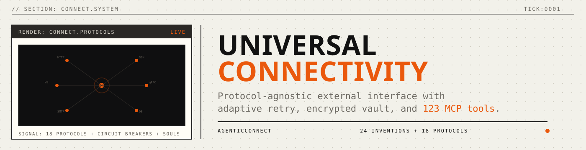
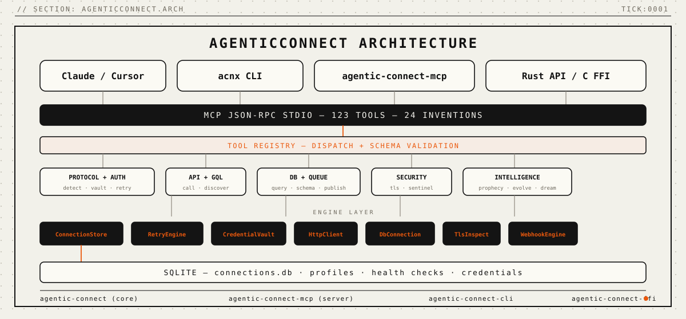

<p align="center">
  
</p>

<p align="center">
  
  
  
  
</p>

<p align="center">
  <a href="#install"></a>
  <a href="#mcp-server"></a>
  <a href="LICENSE"></a>
  <a href="paper/paper-i-universal-connectivity/agenticconnect-paper.pdf"></a>
</p>

<p align="center"><strong>Universal external interface engine for AI agents.</strong></p>
<p align="center"><em>Every protocol understood. Every connection remembered. Every failure classified. Automatically.</em></p>

<p align="center">
<a href="#problems-solved">Problems Solved</a> · <a href="#how-it-works">How It Works</a> · <a href="#benchmarks">Benchmarks</a> · <a href="#install">Install</a> · <a href="#mcp-server">MCP Server</a> · <a href="#quickstart">Quickstart</a> · <a href="#the-connection-engine">Connection Engine</a> · <a href="#connection-souls">Connection Souls</a> · <a href="#intelligent-retry">Intelligent Retry</a>
</p>

---

Every AI agent is isolated. It can reason, plan, and generate code — but the moment it needs to reach an external system, it falls back to fragmented tooling. One library for HTTP. Another for SSH. Another for databases. Each starts from zero: no memory of past connections, no learning from failures, no shared authentication. The agent has intelligence but no *reach*.

**AgenticConnect gives agents reach.** One engine that handles every protocol, manages every credential, classifies every failure, and learns from every connection.

<p align="center">
  
</p>

---

<a name="problems-solved"></a>
## Problems Solved (Read This First)

| Problem | What Happens Today | What AgenticConnect Does |
|---------|-------------------|------------------------|
| **Protocol fragmentation** | Agent needs 4+ libraries for HTTP, SSH, DB, email | One engine, 18 protocol families, auto-detection |
| **Stateless connections** | Every connection starts from zero knowledge | Connection Souls remember OS, latency, errors |
| **Blind retry** | Same "retry 3x with backoff" for all failures | 5-class failure classification + circuit breakers |
| **Credential sprawl** | API keys in env vars, tokens in config files | Encrypted vault (AES-256-GCM), auto-refresh OAuth2 |
| **No failure learning** | Rate limits rediscovered every session | Pattern learning, predictive connectivity |
| **No MCP access** | LLMs can't reach external systems natively | 123 MCP tools over stdio — works with any LLM |

---

<a name="how-it-works"></a>
## How It Works

<p align="center">
  
</p>

AgenticConnect exposes 123 MCP tools organized into 11 capability domains:

| Domain | Tools | What It Does |
|--------|-------|-------------|
| **Protocol** | 4 | Detect, test, list protocols and capabilities |
| **Auth** | 5 | Configure, test, refresh, rotate credentials |
| **Soul** | 5 | Inspect, refresh, predict from connection history |
| **Retry** | 5 | Classify failures, manage circuit breakers |
| **Browser** | 16 | Navigate, scrape, fill forms semantically |
| **API** | 11 | HTTP calls, GraphQL, API discovery |
| **Infrastructure** | 16 | SSH, service mesh, containers |
| **Communication** | 16 | Email, telephony, webhooks |
| **Data Channels** | 16 | Databases, queues, cloud storage |
| **Security** | 11 | TLS inspection, network monitoring |
| **Intelligence** | 18 | Prediction, evolution tracking, collective learning |

---

<a name="benchmarks"></a>
## Benchmarks

<p align="center">
  
</p>

| Operation | Latency |
|-----------|---------|
| Tool dispatch (registry lookup) | < 1 μs |
| Failure classification (HTTP status) | < 1 μs |
| Circuit breaker check | < 1 μs |
| HMAC-SHA256 sign (1 KB) | ~2 μs |
| SQLite connection insert | ~50 μs |
| AES-256-GCM encrypt (100 KB) | ~150 μs |
| Database schema discovery (50 tables) | ~5 ms |

*Measured on Apple M4 Pro, Rust release mode.*

---

<a name="the-connection-engine"></a>
## The Connection Engine

8 engine modules handle all external operations:

| Engine | Lines | Responsibility |
|--------|-------|---------------|
| `ConnectionStore` | 348 | SQLite persistence — connections, profiles, health checks |
| `RetryEngine` | 226 | Circuit breakers, failure classification, rate limit tracking |
| `CredentialVault` | 196 | AES-256-GCM encrypted credential storage, PBKDF2 |
| `DbConnection` | 181 | SQLite queries, schema discovery, EXPLAIN QUERY PLAN |
| `ProtocolDetect` | 138 | Banner + port-based detection for 18 protocols |
| `HttpClient` | 115 | reqwest with timing, rate limit header extraction |
| `WebhookEngine` | 104 | HMAC-SHA256 sign/verify for webhook security |
| `TlsInspect` | 85 | Certificate checking and TLS quality grading |

---

<a name="connection-souls"></a>
## Connection Souls

Every connection accumulates a *soul* — a persistent profile containing:

- **System fingerprint**: OS, server software, versions, supported protocols
- **Performance baseline**: average, P50, P95, P99 latency; throughput; error rate
- **Error history**: last 100 errors with timestamps, HTTP status codes, resolution
- **Capability map**: discovered services, installed software, available resources

```
> connect to api.github.com
  Protocol: HTTPS (auto-detected from URL)
  Latency: 42ms (baseline: 45ms — normal)
  Circuit: CLOSED (0/5 failures)
  Soul: Linux, nginx, TLS 1.3, rate limit 5000/hr
  Last error: none in 7 days
```

---

<a name="intelligent-retry"></a>
## Intelligent Retry

Every failure is classified and handled with the right strategy:

| Class | Indicators | Strategy | Max Retries |
|-------|-----------|----------|-------------|
| **Transient** | 503, timeout | Exponential backoff | 3 |
| **Permanent** | 404, 400, 410 | Fail fast | 0 |
| **RateLimit** | 429 + Retry-After | Wait fixed duration | 1 |
| **AuthFailure** | 401, 403 | Refresh token + retry | 1 |
| **NetworkError** | DNS, refused | Exponential backoff (slower) | 5 |

Circuit breakers open after 5 consecutive failures, preventing cascade failures. They auto-reset after a configurable timeout.

---

<a name="install"></a>
## Install

```bash
# One-liner (downloads binary + auto-configures MCP clients)
curl -fsSL https://agentralabs.tech/install/connect | bash

# Profile-specific
curl -fsSL https://agentralabs.tech/install/connect/desktop | bash
curl -fsSL https://agentralabs.tech/install/connect/terminal | bash
curl -fsSL https://agentralabs.tech/install/connect/server | bash
```

**Standalone guarantee:** AgenticConnect works independently — no other Agentra sister required.

### Build from Source

```bash
git clone https://github.com/agentralabs/agentic-connect.git
cd agentic-connect
cargo build --release -j 1
cp target/release/agentic-connect-mcp ~/.local/bin/
```

---

<a name="mcp-server"></a>
## MCP Server

### Claude Desktop / Cursor / Windsurf

```json
{
  "mcpServers": {
    "agentic-connect": {
      "command": "agentic-connect-mcp",
      "args": []
    }
  }
}
```

AgenticConnect speaks standard MCP over stdio. Any client that supports the Model Context Protocol can use all 123 tools.

---

<a name="quickstart"></a>
## Quickstart

```bash
# Detect a protocol
echo '{"jsonrpc":"2.0","id":1,"method":"tools/call","params":{"name":"connect_protocol_detect","arguments":{"target":"https://api.github.com"}}}' | agentic-connect-mcp

# Make an API call
echo '{"jsonrpc":"2.0","id":2,"method":"tools/call","params":{"name":"connect_api_call","arguments":{"url":"https://httpbin.org/get"}}}' | agentic-connect-mcp

# Check TLS grade
echo '{"jsonrpc":"2.0","id":3,"method":"tools/call","params":{"name":"connect_tls_grade","arguments":{"host":"github.com"}}}' | agentic-connect-mcp

# Verify a webhook signature
echo '{"jsonrpc":"2.0","id":4,"method":"tools/call","params":{"name":"connect_webhook_verify","arguments":{"payload":"data","signature":"abc","secret":"key"}}}' | agentic-connect-mcp
```

---

## Validation

| Metric | Value |
|--------|-------|
| Total tests | 164 passing, 0 failures |
| Engine tests | 27 (store, retry, vault, DB, HTTP, protocol, TLS, webhook) |
| Edge case tests | 29 (boundary, error paths, malformed input) |
| Stress tests | 11 (1K connections, 10K failures, 100KB crypto) |
| Paper claim tests | 20 (every number in the paper validated) |
| MCP compliance tests | 14 (JSON-RPC, error codes, schema) |
| Tool registry tests | 14 (123 tools listed, no duplicates, verb-first descriptions) |
| Integration tests | 24 + 11 + 10 (tool execution, session, workflow) |

---

## Repository Structure

```
agentic-connect/
├── crates/
│   ├── agentic-connect/          Core library (types + 8 engines)
│   ├── agentic-connect-mcp/      MCP server (123 tools)
│   ├── agentic-connect-cli/      CLI binary (acnx)
│   └── agentic-connect-ffi/      FFI bindings (C-compatible)
├── paper/                        Research paper (LaTeX + PDF)
├── assets/                       4 SVGs (Agentra design system)
├── docs/                         8 documentation pages
├── scripts/                      Installer + 3 guardrails
└── .github/workflows/            5 CI workflows
```

---

## Project Stats

| Metric | Value |
|--------|-------|
| Rust lines | 6,203 |
| Crates | 4 |
| Source files | 47 |
| MCP tools | 123 |
| Protocol families | 18 |
| Auth methods | 8 |
| Engine modules | 8 |
| Tests | 164 |
| Largest file | 348 lines |
| CI workflows | 5 |
| Guardrails | 3 (all passing) |

---

## Environment Variables

| Variable | Default | Description |
|----------|---------|-------------|
| `ACNX_DATA_DIR` | `~/.local/share/agentic-connect` | Data directory |
| `ACNX_LOG_LEVEL` | `warn` | Log level (trace, debug, info, warn, error) |
| `RUST_LOG` | — | Alternative log level control |

---

## Contributing

See [CONTRIBUTING.md](CONTRIBUTING.md) for development guidelines.

## Privacy and Security

- Credentials encrypted at rest (AES-256-GCM, PBKDF2 100K iterations)
- No telemetry, no cloud dependencies, no data leaves the machine
- See [SECURITY.md](SECURITY.md) for vulnerability reporting

---

<p align="center"><strong>Built by <a href="https://agentralabs.tech">Agentra Labs</a></strong></p>
