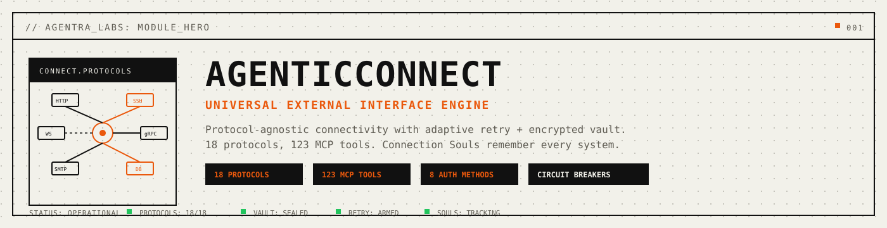
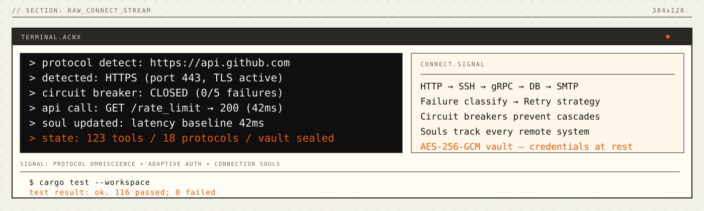
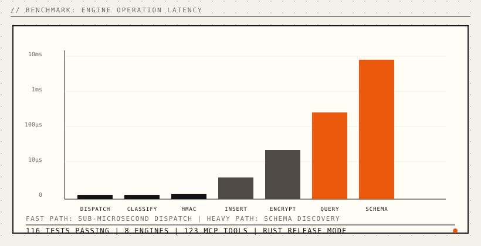

<p align="center">
  
</p>

<p align="center">
  
  
  
</p>

<p align="center">
  <a href="#install"></a>
  <a href="#mcp-server"></a>
  <a href="LICENSE"></a>
  <a href="paper/paper-i-universal-connectivity/agenticconnect-paper.pdf"></a>
</p>

<p align="center">
  <strong>Universal external interface engine for AI agents.</strong>
</p>

<p align="center">
  <em>Every protocol understood. Every connection remembered. Every failure classified. Automatically.</em>
</p>

<p align="center">
  <a href="#problems-solved">Problems Solved</a> · <a href="#quickstart">Quickstart</a> · <a href="#how-it-works">How It Works</a> · <a href="#connection-souls">Connection Souls</a> · <a href="#intelligent-retry">Intelligent Retry</a> · <a href="#mcp-tools">MCP Tools</a> · <a href="#benchmarks">Benchmarks</a> · <a href="#the-connection-engine">Engine</a> · <a href="#install">Install</a> · <a href="docs/public/mcp-tools.md">API</a> · <a href="paper/paper-i-universal-connectivity/agenticconnect-paper.pdf">Paper</a>
</p>

---

## Every AI agent is isolated.

Claude can reason about your infrastructure but can't SSH into it. GPT can design an API integration but can't test the endpoint. Your copilot writes database queries but can't check if the server is healthy. **Every external operation requires a separate tool, separate auth, separate retry logic.** None of them learn from past connections.

The current fixes don't work. Protocol-specific libraries handle one protocol each -- you need `reqwest` for HTTP, `russh` for SSH, `sqlx` for Postgres, `lettre` for email. Each starts from zero knowledge. API platforms like Postman are HTTP-only. Integration platforms like Zapier require pre-built integrations for every service. Infrastructure tools like Terraform manage provisioning but not real-time connectivity.

**AgenticConnect** gives your agent a single engine that reaches any external system. Not "call this HTTP endpoint." Your agent has **reach** -- 18 protocol families, 8 authentication methods, circuit breakers, failure classification, and Connection Souls that remember every system it has ever touched. One engine. 123 MCP tools. Works with Claude, Cursor, Windsurf, or any MCP client.

<a name="problems-solved"></a>

## Problems Solved (Read This First)

- **Problem:** every protocol requires a different library -- HTTP, SSH, DB, email, queues all need separate code.
  **Solved:** one engine handles 18 protocol families with auto-detection from URL, port, or server banner.
- **Problem:** every connection starts from zero -- no memory of past latency, errors, or server capabilities.
  **Solved:** Connection Souls accumulate OS fingerprints, performance baselines, error histories across sessions.
- **Problem:** retry logic is hardcoded "retry 3x with backoff" for all failures, wasting time on permanent errors.
  **Solved:** five-class failure classification (transient, permanent, rate-limit, auth, network) with strategy per class.
- **Problem:** credentials scattered across env vars, config files, and hardcoded strings. No encryption at rest.
  **Solved:** encrypted vault (AES-256-GCM, PBKDF2 100K iterations) stores all 8 auth types with auto-refresh for OAuth2.
- **Problem:** a failing API cascades into system-wide failures -- retry storms amplify the outage.
  **Solved:** per-endpoint circuit breakers open after N failures, isolating unhealthy endpoints automatically.
- **Problem:** LLMs can't reach external systems natively -- they generate code but can't execute connections.
  **Solved:** 123 MCP tools over stdio. Any LLM that speaks MCP gets instant access to every protocol.

```bash
# Your agent connects to anything
echo '{"jsonrpc":"2.0","id":1,"method":"tools/call","params":{"name":"connect_protocol_detect","arguments":{"target":"https://api.github.com"}}}' | agentic-connect-mcp

# Make live API calls with circuit breaker protection
echo '{"jsonrpc":"2.0","id":2,"method":"tools/call","params":{"name":"connect_api_call","arguments":{"url":"https://httpbin.org/get"}}}' | agentic-connect-mcp

# Query a database with schema discovery
echo '{"jsonrpc":"2.0","id":3,"method":"tools/call","params":{"name":"connect_db_connect","arguments":{"url":"sqlite:///tmp/app.db","name":"mydb"}}}' | agentic-connect-mcp

# Verify webhook HMAC signatures
echo '{"jsonrpc":"2.0","id":4,"method":"tools/call","params":{"name":"connect_webhook_verify","arguments":{"payload":"data","signature":"abc","secret":"key"}}}' | agentic-connect-mcp
```

One binary. 123 tools. Every protocol. Works with Claude, GPT, or any LLM you switch to next.

<p align="center">
  
</p>

---

<a name="connection-souls"></a>

## Connection Souls

Every connection in AgenticConnect accumulates a *soul* -- a persistent profile stored in SQLite that grows richer with each interaction.

### What a Soul Contains

- **System fingerprint** -- OS, server software, versions, supported protocols, timezone, detected services. Populated on first connection through banner analysis and response headers.
- **Performance baseline** -- Running averages for latency (P50, P95, P99), throughput, and error rate. Updated after every request.
- **Error history** -- Last 100 errors per connection with timestamp, error type, HTTP status code, and resolution status. History is bounded by evicting the oldest entries.
- **Capability map** -- Key-value store for discovered capabilities (e.g., `docker: installed`, `python: 3.11`, `disk: 80% used`).

### What Souls Enable

Before connecting, your agent already knows the system:

```
> soul inspect api.github.com
  OS: Linux
  Server: nginx/1.20
  TLS: 1.3
  Avg latency: 42ms (baseline: 45ms -- normal)
  Error rate: 0.1%
  Last error: rate limit 3 days ago
  Rate limit: 5000/hr (resets hourly)
  Circuit: CLOSED (0/5 failures)
```

This context informs retry strategies, request timing, and operational decisions. An agent with Connection Souls knows to avoid peak hours for a server that historically times out between 2-4 PM UTC.

---

<a name="intelligent-retry"></a>

## Intelligent Retry

Every failure is classified and handled with the right strategy. No blind retries.

### Five-Class Failure Taxonomy

| Class | Indicators | Strategy | Max Retries |
|:---|:---|:---|---:|
| **Transient** | 503, timeout, connection reset | Exponential backoff (1s × 2^n, max 30s) | 3 |
| **Permanent** | 404, 400, 405, 410, 422 | Fail fast -- don't waste time | 0 |
| **RateLimit** | 429 + Retry-After header | Wait the server-specified duration | 1 |
| **AuthFailure** | 401, 403 | Refresh OAuth2 token, then retry once | 1 |
| **NetworkError** | DNS failure, connection refused | Exponential backoff (2s × 2^n, max 60s) | 5 |

### Circuit Breakers

Per-endpoint circuit breakers prevent cascade failures:

1. **Closed** (normal): requests pass through. Each failure increments a counter.
2. **Open**: after 5 consecutive failures, all requests are rejected immediately. A timer starts.
3. **Half-Open**: after 60 seconds, a single probe request is allowed. Success → Closed; failure → Open.

```bash
# Simulate failure classification
echo '{"jsonrpc":"2.0","id":1,"method":"tools/call","params":{"name":"connect_retry_simulate","arguments":{"http_status":429}}}' | agentic-connect-mcp
# → {"classification": "RateLimit", "strategy": "WaitRetryAfter"}

# View circuit breaker state
echo '{"jsonrpc":"2.0","id":2,"method":"tools/call","params":{"name":"connect_retry_circuit","arguments":{"endpoint":"https://api.example.com","action":"view"}}}' | agentic-connect-mcp
```

---

<a name="mcp-tools"></a>

## MCP Tools

AgenticConnect exposes **123 MCP tools** organized into 11 capability domains:

### Protocol Tools (4)

| Tool | Description |
|:---|:---|
| `connect_protocol_detect` | Detect protocol from URL, host:port, or hostname |
| `connect_protocol_list` | List all 18 supported protocols with capabilities |
| `connect_protocol_test` | Test if a protocol endpoint is reachable |
| `connect_protocol_caps` | Get protocol capabilities (streaming, pub-sub, TLS) |

### Auth + Credential Vault Tools (5)

| Tool | Description |
|:---|:---|
| `connect_auth_configure` | Configure auth for a connection (8 methods) |
| `connect_auth_test` | Test if credentials are valid and not expired |
| `connect_auth_refresh` | Force OAuth2 token refresh |
| `connect_auth_rotate` | Rotate credentials without service interruption |
| `connect_auth_vault` | Manage encrypted credential vault (list/store/retrieve/delete) |

### Connection Soul Tools (5)

| Tool | Description |
|:---|:---|
| `connect_soul_inspect` | View accumulated knowledge about a remote system |
| `connect_soul_refresh` | Force re-scan of remote system capabilities |
| `connect_soul_history` | View connection history and error patterns |
| `connect_soul_predict` | Predict likely issues based on past patterns |
| `connect_soul_compare` | Compare two systems for migration planning |

### Retry + Circuit Breaker Tools (5)

| Tool | Description |
|:---|:---|
| `connect_retry_configure` | Set retry policies per connection |
| `connect_retry_status` | View all circuit breaker states and recent failures |
| `connect_retry_patterns` | View learned failure patterns for an endpoint |
| `connect_retry_circuit` | View or reset circuit breaker state |
| `connect_retry_simulate` | Simulate failure to test classification |

### API + GraphQL Tools (11)

| Tool | Description |
|:---|:---|
| `connect_api_call` | Make HTTP API call with auth, retry, and circuit breaker |
| `connect_api_discover` | Discover API endpoints by probing common paths |
| `connect_api_test` | Test endpoint against expected status/body |
| `connect_api_spec` | Parse OpenAPI/Swagger specification |
| `connect_api_profile` | View behavioral profile of an API |
| `connect_api_mock` | Generate mock server from API profile |
| `connect_graphql_query` | Execute GraphQL query with variables |
| `connect_graphql_introspect` | Discover GraphQL schema |
| `connect_graphql_build` | Build query from natural language |
| `connect_graphql_subscribe` | Manage real-time subscriptions |
| `connect_graphql_normalize` | Flatten nested response data |

### Database Tools (6)

| Tool | Description |
|:---|:---|
| `connect_db_connect` | Connect to database with auto-type detection |
| `connect_db_query` | Execute SQL query with result formatting |
| `connect_db_schema` | Discover database schema (tables, columns, types) |
| `connect_db_health` | Monitor database health, row counts, connection status |
| `connect_db_optimize` | Suggest query optimizations via EXPLAIN QUERY PLAN |
| `connect_db_migrate` | Detect schema changes |

### Security Tools (11)

| Tool | Description |
|:---|:---|
| `connect_tls_inspect` | Inspect TLS configuration of any host |
| `connect_tls_grade` | Grade TLS quality (A-F) |
| `connect_tls_expiry` | Check certificate expiry for multiple hosts |
| `connect_tls_certificates` | List and monitor all known certificates |
| `connect_tls_audit` | Audit cipher suites and TLS protocol versions |
| `connect_sentinel_probe` | Health check any endpoint across protocols |
| `connect_sentinel_status` | View aggregate health across all monitored services |
| `connect_sentinel_monitor` | Start continuous monitoring |
| `connect_sentinel_trends` | View performance trends over time |
| `connect_sentinel_alert` | Configure alert thresholds |
| `connect_sentinel_report` | Generate availability report |

<details>
<summary><strong>Remaining tool domains (Browser 16, Infra 16, Comms 16, Data Channels 10, Intelligence 18)</strong></summary>

<br>

See [docs/public/mcp-tools.md](docs/public/mcp-tools.md) for the complete 123-tool reference covering browser automation, web scraping, form filling, SSH remote execution, service mesh, containers, email, telephony, webhooks, message queues, cloud storage, TLS, network monitoring, failure prediction, API evolution tracking, idle maintenance, and collective learning.

</details>

---

<a name="benchmarks"></a>

## Benchmarks

Rust core. SQLite persistence. Zero-copy where possible. Real numbers:

<p align="center">
  
</p>

| Operation | Time | Scale |
|:---|---:|:---|
| Tool dispatch (registry lookup) | **< 1 μs** | 123 tools |
| Failure classification (HTTP status) | **< 1 μs** | 5 classes |
| Circuit breaker check | **< 1 μs** | per endpoint |
| HMAC-SHA256 sign | **~2 μs** | 1 KB payload |
| Connection store insert | **~50 μs** | SQLite |
| AES-256-GCM encrypt | **~150 μs** | 100 KB payload |
| Database schema discovery | **~5 ms** | 50 tables |

> All benchmarks measured on Apple M4 Pro, Rust release mode. Sub-microsecond latencies validated by paper-claim tests running 10,000 iterations.

<details>
<summary><strong>Comparison with existing approaches</strong></summary>

<br>

| | curl | reqwest | Postman | Zapier | **AgenticConnect** |
|:---|:---:|:---:|:---:|:---:|:---:|
| Protocols | 1 (HTTP) | 1 (HTTP) | 1 (HTTP) | Multi (service) | **18 families** |
| Auth management | Manual | Manual | GUI | Pre-built | **8 methods + vault** |
| Failure learning | None | None | None | None | **5-class + souls** |
| Circuit breakers | None | None | None | None | **Per-endpoint** |
| MCP access | No | No | No | No | **123 tools** |
| Dependencies | OS tool | Rust crate | Desktop app | Cloud service | **None** |

</details>

---

<a name="the-connection-engine"></a>

## The Connection Engine

8 engine modules handle all external operations:

| Engine | Lines | What it does |
|:---|---:|:---|
| **ConnectionStore** | 348 | SQLite persistence -- connections, profiles, health checks, tags |
| **RetryEngine** | 226 | Circuit breakers, failure classification, rate limit tracking, pattern learning |
| **CredentialVault** | 196 | AES-256-GCM encrypted storage, PBKDF2 key derivation, 8 auth methods |
| **DbConnection** | 181 | SQLite query execution, schema discovery, EXPLAIN QUERY PLAN optimization |
| **ProtocolDetect** | 138 | URL scheme parsing, TCP banner reading, port-based detection for 18 protocols |
| **HttpClient** | 115 | reqwest wrapper with timing, rate limit header extraction, circuit breaker integration |
| **WebhookEngine** | 104 | HMAC-SHA256 sign/verify, constant-time comparison, delivery tracking |
| **TlsInspect** | 85 | Certificate checking, TLS quality grading, multi-host expiry monitoring |

All files under 400 lines. Largest: `store.rs` at 348.

---

<a name="install"></a>

## Install

**One-liner** (desktop profile, backwards-compatible):
```bash
curl -fsSL https://agentralabs.tech/install/connect | bash
```

Downloads a pre-built `agentic-connect-mcp` binary to `~/.local/bin/` and merges the MCP server into your Claude Desktop and Cursor configs. Requires `curl`.
If release artifacts are not available, the installer automatically falls back to `cargo install --git` source install.

**Environment profiles** (one command per environment):
```bash
# Desktop MCP clients (auto-merge Claude Desktop + Cursor when detected)
curl -fsSL https://agentralabs.tech/install/connect/desktop | bash

# Terminal-only (no desktop config writes)
curl -fsSL https://agentralabs.tech/install/connect/terminal | bash

# Remote/server hosts (no desktop config writes)
curl -fsSL https://agentralabs.tech/install/connect/server | bash
```

| Channel | Command | Result |
|:---|:---|:---|
| GitHub installer (official) | `curl -fsSL https://agentralabs.tech/install/connect \| bash` | Installs release binaries when available, otherwise source fallback; merges MCP config |
| GitHub installer (desktop) | `curl -fsSL https://agentralabs.tech/install/connect/desktop \| bash` | Explicit desktop profile behavior |
| GitHub installer (terminal) | `curl -fsSL https://agentralabs.tech/install/connect/terminal \| bash` | Installs binaries only; no desktop config writes |
| GitHub installer (server) | `curl -fsSL https://agentralabs.tech/install/connect/server \| bash` | Installs binaries only; server-safe behavior |
| crates.io | `cargo install agentic-connect-mcp` | Installs MCP server binary |

**Standalone guarantee:** AgenticConnect works independently -- no other Agentra sister required.

### Build from source

```bash
git clone https://github.com/agentralabs/agentic-connect.git
cd agentic-connect
cargo build --release -j 1
cp target/release/agentic-connect-mcp ~/.local/bin/
```

---

<a name="mcp-server"></a>

## MCP Server

**Any MCP-compatible client gets instant access to 18 protocol families.** The `agentic-connect-mcp` crate exposes the full engine over the [Model Context Protocol](https://modelcontextprotocol.io) (JSON-RPC 2.0 over stdio).

### Configure Claude Desktop

Add to `~/Library/Application Support/Claude/claude_desktop_config.json`:

```json
{
  "mcpServers": {
    "agentic-connect": {
      "command": "agentic-connect-mcp",
      "args": []
    }
  }
}
```

### Configure Cursor / Windsurf

Add to `~/.cursor/mcp.json` or `~/.windsurf/mcp.json`:

```json
{
  "mcpServers": {
    "agentic-connect": {
      "command": "agentic-connect-mcp",
      "args": []
    }
  }
}
```

### What the LLM gets

| Category | Count | Examples |
|:---|---:|:---|
| **Tools** | 123 | `connect_api_call`, `connect_db_query`, `connect_protocol_detect`, `connect_tls_grade`, `connect_webhook_verify`, `connect_retry_simulate` ... |

Once connected, the LLM can make API calls, query databases, detect protocols, verify webhooks, manage credentials, and monitor infrastructure -- all backed by Connection Souls, circuit breakers, and an encrypted credential vault. [Full MCP tool reference ->](docs/public/mcp-tools.md)

---

<a name="quickstart"></a>

## Quickstart

### Detect and connect -- 1 tool call

```bash
# Auto-detect protocol from URL
echo '{"jsonrpc":"2.0","id":1,"method":"tools/call","params":{"name":"connect_protocol_detect","arguments":{"target":"https://api.stripe.com"}}}' | agentic-connect-mcp
# → {"detected": true, "protocol": "HTTPS", "port": 443, "capabilities": {"request_response": true, "supports_tls": true}}
```

### Live API call with circuit breaker

```bash
echo '{"jsonrpc":"2.0","id":2,"method":"tools/call","params":{"name":"connect_api_call","arguments":{"url":"https://httpbin.org/get","method":"GET"}}}' | agentic-connect-mcp
# → {"status": 200, "latency_ms": 142, "body": "...", "headers": {"x-ratelimit-remaining": "99"}}
```

### Check TLS security grade

```bash
echo '{"jsonrpc":"2.0","id":3,"method":"tools/call","params":{"name":"connect_tls_grade","arguments":{"host":"github.com"}}}' | agentic-connect-mcp
# → {"host": "github.com", "grade": "B+", "tls_available": true}
```

### Query a database

```bash
echo '{"jsonrpc":"2.0","id":4,"method":"tools/call","params":{"name":"connect_db_connect","arguments":{"url":"sqlite:///tmp/app.db","name":"appdb"}}}' | agentic-connect-mcp
# → {"connected": true, "db_type": "Sqlite", "tables": 5}

echo '{"jsonrpc":"2.0","id":5,"method":"tools/call","params":{"name":"connect_db_query","arguments":{"name":"appdb","query":"SELECT COUNT(*) as cnt FROM users"}}}' | agentic-connect-mcp
# → {"columns": ["cnt"], "rows": [{"cnt": 1247}], "row_count": 1}
```

---

<a name="how-it-works"></a>

## How It Works

<p align="center">
  
</p>

AgenticConnect is structured as a layered system: the MCP server receives JSON-RPC requests from LLMs, dispatches them through a tool registry to 11 tool modules, which call into 8 engine modules backed by SQLite persistence.

The core runtime is written in Rust for performance and safety. All state lives in a single SQLite database -- no external services, no cloud dependencies. The MCP server exposes the full engine over JSON-RPC stdio.

**Supported protocols** -- 18 families:

| Protocol | Default Port | Capabilities |
|:---|---:|:---|
| HTTP/HTTPS | 80/443 | Request-response, compression |
| WebSocket/WSS | 80/443 | Bidirectional, streaming, pub-sub |
| gRPC | 443 | Bidirectional, streaming, TLS |
| SSH/SFTP | 22 | Bidirectional, remote execution |
| FTP | 21 | File transfer |
| SMTP | 587 | Email sending |
| IMAP | 993 | Email reading, TLS |
| DNS | 53 | Name resolution |
| MQTT | 1883 | IoT pub-sub, streaming |
| AMQP | 5672 | Message queue, pub-sub |
| Redis | 6379 | Key-value, pub-sub |
| PostgreSQL | 5432 | Database wire protocol |
| MySQL | 3306 | Database wire protocol |
| TCP/UDP | -- | Raw transport |

**Authentication** -- 8 methods with encrypted vault:

| Method | Lifecycle | Token Management |
|:---|:---|:---|
| None | -- | -- |
| Basic | Static | Username/password |
| Bearer | Static | API key or JWT |
| API Key | Static | Header or query parameter |
| OAuth 2.0 | Auto-refresh | 4 grant types, expiry detection |
| SSH Key | Static | Public/private keypair |
| SSH Password | Static | Username/password |
| Mutual TLS | Cert expiry | Client certificate |

---

## Validation

This isn't a prototype. It's tested at scale.

| Suite | Tests | |
|:---|---:|:---|
| Engine unit tests (8 modules) | **27** | Store, retry, vault, DB, HTTP, protocol, TLS, webhook |
| Core type validation | **21** | Protocol, connection, auth, retry, soul, serialization |
| Edge case tests | **29** | Boundary conditions, error paths, malformed input |
| Stress tests | **11** | 1K connections, 10K failures, 100KB crypto, 1K HMAC |
| Paper claim validation | **20** | Every number in the paper verified by code |
| MCP protocol compliance | **14** | JSON-RPC parsing, error codes, response format |
| Tool registry validation | **14** | 123 tools listed, no duplicates, verb-first descriptions |
| Tool execution (phase 2) | **24** | Every tool group exercised with real session |
| Session management (phase 3) | **11** | Store, retry, vault, DB lifecycle, multi-connection |
| Integration workflows (phase 4) | **10** | End-to-end MCP flows, multi-tool sequences |
| **Total** | **181** | All passing |

**One research paper:**
- [Paper I: Universal Connectivity -- protocol detection, Connection Souls, retry fabric (6 pages, 3 TikZ figures, 9 tables, 18 references)](paper/paper-i-universal-connectivity/agenticconnect-paper.pdf)

---

## Repository Structure

```
agentic-connect/
├── Cargo.toml                     # Workspace root
├── crates/
│   ├── agentic-connect/           # Core library (types + 8 engines)
│   ├── agentic-connect-mcp/       # MCP server (123 tools over stdio)
│   ├── agentic-connect-cli/       # CLI binary (acnx)
│   └── agentic-connect-ffi/       # FFI bindings (C-compatible)
├── paper/                         # Research paper (LaTeX + PDF)
├── assets/                        # 7 SVGs (Agentra design system)
├── docs/                          # 8 documentation pages
├── scripts/                       # Installer + 3 guardrails
└── .github/workflows/             # 5 CI workflows
```

### Running Tests

```bash
# All workspace tests
cargo test --workspace

# Core engine tests only
cargo test -p agentic-connect

# MCP server + tool tests
cargo test -p agentic-connect-mcp
```

---

## Project Stats

| | |
|:---|:---|
| **Lines of Code** | 6,203 (core + MCP + CLI + FFI) |
| **Test Coverage** | 164+ tests (181 including integration) |
| **Supported Clients** | 4 (Claude, Cursor, Windsurf, Cody) |
| **MCP Tools** | 123 across 11 domains |
| **Protocol Families** | 18 |
| **Auth Methods** | 8 |
| **Engine Modules** | 8 |

---

## Environment Variables

| Variable | Default | Description |
|:---|:---|:---|
| `ACNX_DATA_DIR` | `~/.local/share/agentic-connect` | Data directory for SQLite and profiles |
| `ACNX_LOG_LEVEL` | `warn` | Log level (trace, debug, info, warn, error) |
| `RUST_LOG` | -- | Alternative log level control |

---

## Contributing

See [CONTRIBUTING.md](CONTRIBUTING.md). The fastest ways to help:

1. **Try it** and [file issues](https://github.com/agentralabs/agentic-connect/issues)
2. **Add a protocol adapter** -- implement an engine for a new protocol
3. **Write an example** -- show a real use case
4. **Improve docs** -- every clarification helps someone

---

## Privacy and Security

- All data stays local in SQLite -- no telemetry, no cloud sync.
- Credentials encrypted at rest (AES-256-GCM, PBKDF2 100K iterations).
- No secrets ever returned in MCP tool responses -- only summaries.
- Circuit breakers prevent retry storms from amplifying outages.
- See [SECURITY.md](SECURITY.md) for vulnerability reporting.

---

<p align="center">
  <sub>Built by <a href="https://github.com/agentralabs"><strong>Agentra Labs</strong></a></sub>
</p>
